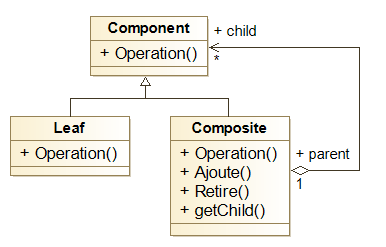
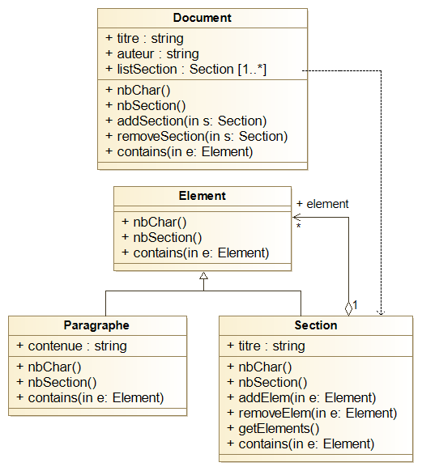
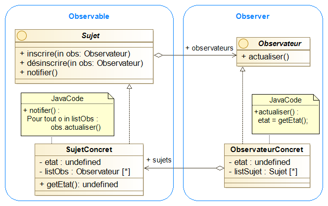

# Java_GL
## Exercice de Java (Pattern etc)
>MIN17201 Programmation, Génie Logiciel et Preuve

### Enoncée mai 2021 :

#### Exercice 1 (Pattern Builder): 
Dans le package [book](./src/main/java/book) :
1. déclaration classe [Livre](./src/main/java/book/Livre.java)
1. constructeur [Livre](./src/main/java/book/Livre.java)
1. classe [LivreBuilder](./src/main/java/book/LivreBuilder.java)
1. test unitaire JUnit 4 montrant la création d'un livre : [lien](./src/test/java/book/LivreBuilderTest.java)
1. méthode de génération de la table des matières : [lien](./src/main/java/book/Livre.java)
1. test unitaire JUnit 4 montrant la méthode précédente : [lien](./src/test/java/book/LivreTest.java)

#### Exercice 2 (Pattern Composite):
Dans le package [doc](./src/main/java/doc)
1. un diagramme de classe UML (avec attributs et méthodes) présentant votre solution.
    
    Le diagramme type du pattern composite : 
    
    
    Le diagramme de l'exercice (pas parfait mais général): 
    

1. le code Java des classes [Section](./src/main/java/doc/Section.java) et [Paragraphe](./src/main/java/doc/Paragraphe.java)
1. le code Java des autres classes : [Element](./src/main/java/doc/Element.java) ; [Document](./src/main/java/doc/Document.java)
1. un test JUnit 4 vérifiant le calcul du nombre de caractères : [lien](./src/test/java/doc/DocumentTest.java)
1. un test JUnit 4 vérifiant le calcul du nombre de sections : [lien](./src/test/java/doc/DocumentTest.java)

#### Exercice 3 (Pattern Observateur):
Dans le package [system](./src/main/java/system)
1. un diagramme de classe UML (avec attributs et méthodes) présentant votre solution.
    
    Le diagramme type du pattern observateur : 
    
       
    Le diagramme de l'exercice (pas parfait mais général): 
    

1. le code Java de la classe [Producteur](./src/main/java/system/Producteur.java)
1. le code Java de la classe [Consommateur](./src/main/java/system/Consommateur.java)
1. un test JUnit 4 illustrant un scénario : [lien](./src/test/java/system/ScenarioTest.java)

### Enoncé 2017
#### Exercice 3 (Persistence avec JDBC et Pattern DAO):
Dans le package [library](./src/main/java/library)

Dans cet exercice, vous allez développer, avec JDBC et le pattern DAO, la couche de persistance d'une application gérant un ensemble d'ouvrages.
Un **livre** est identifié par son numéro ISBN, possède un titre et est écrit par un ou plusieurs auteurs.
Un **auteur** possède un nom et une adresse email. Un auteur peut écrire plusieurs livres (zéro ou plus) et chaque livre peut être écrit par plusieurs auteurs (au moins un).
L'application doit permettre :
 * d'afficher les caractéristiques des livres (dont les auteurs),
 * pour chaque auteur, d'afficher sa bibliographie.

1. Donnez un diagramme de [classes UML](./uml/Diagramme_de_classe-Library.png) qui modélise cet énoncé (uniquement le domaine sans la couche de persistance).
2. Donnez l'implémentation Java de la classe [Auteur](./src/main/java/library/Author.java). L'affichage des caractéristiques de l'auteur se fera avec la méthode toString.
3. Faites de même pour la classe [Livre](./src/main/java/library/Book.java). 

Dans la suite, on suppose l'existence de la classe abstraite [DAO<T>](./src/main/java/library/dao/Dao.java) vue en cours. En particulier, vous supposerez que les tables sont présentes dans le SGBD.
4. Proposez une implémentation Java pour une classe [Connexion](./src/main/java/library/dao/DaoAbstractFactory.java) gérant la connexion à un SGBD. Pour cela, vous vous appuierez sur le pattern Singleton (énumération des connections BD). Vous réaliserez cette classe pour une connexion à MySQL sur localhost et la BD exam (utilisateur user, mot de passe passwd).
5. Donnez le squelette (déclaration et signature des méthodes) des classes DAO nécessaires.
> les classes DaoJdbcFactory ; AuthorDao ; BookDao
6. Donnez l'implémentation de la méthode [AuteurDAO](./src/main/java/library/dao/AuthorDao.java).create qui rend persistant un auteur. En particulier, proposez une solution pour la persistance de l'association auteur-livre.
> La relation auteur-livre est implémenté dans une table relationnel write.
7. Donnez l'implémentation de la méthode [AuteurDAO](./src/main/java/library/dao/AuthorDao.java).find qui recherche un auteur à partir de son nom.

Dans la suite, on suppose que les classes DAO sont totalement implémentées.
8. Donnez l'[extrait de code](./src/main/java/library/Main.java) qui crée deux auteurs, les deux livres qu'ils ont écrits et rend les objets persistants.
9. Donnez l'[extrait de code](./src/main/java/library/Main.java) qui récupère un auteur et affiche sa bibliographie.
10. Donnez le code de la classe [DaoJdbcFactory](./src/main/java/library/dao/DaoJdbcFactory.java) qui implémente le pattern Fabrique pour la création des DAO.
11. Donnez le code de la classe [DaoAbstractFactory](./src/main/java/library/dao/DaoAbstractFactory.java) qui implémente le pattern Fabrique Abstraite pour la création des DAO.
12. Quels changements faut-il apporter au code qui utilise ces DAO ?
> J'ignore ce qui est a dire ici mais je ferais remarquer que la structure est "cyclique" entre les auteurs et les livres donc complexe à maintenir cohérente.
> De plus il serait plus aisé d'avoir une "bibliothèque" (une liste des livres instanciés) dans l'execution.
13. Donnez un diagramme de classes UML qui reprend l'ensemble des classes créées et leurs relations.
> Trop complexe pour le faire proprement.